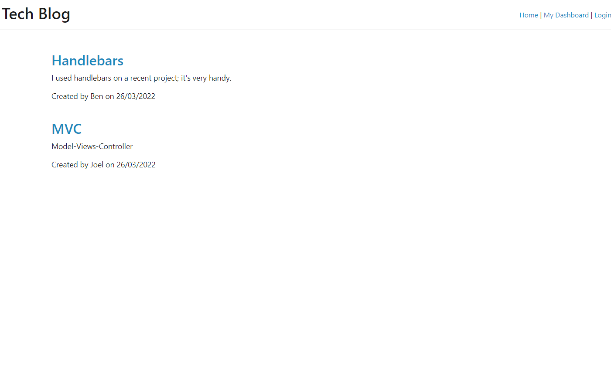
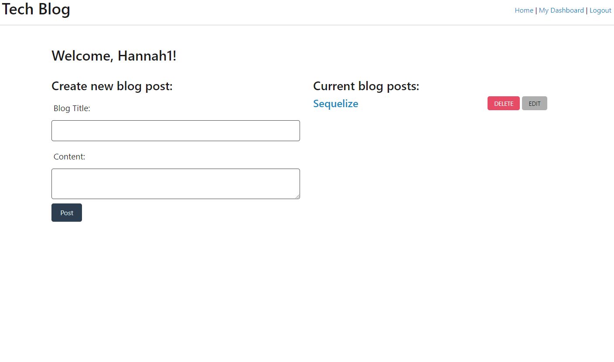
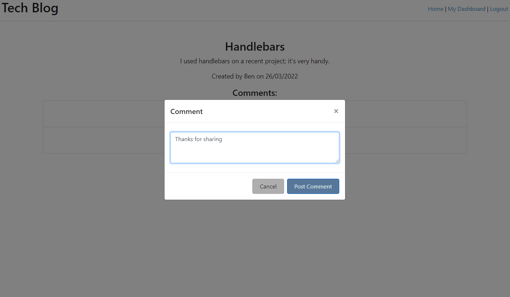

# Tech Blog
[License: MIT](https://img.shields.io/badge/License-MIT-yellow.svg)

## Table of Contents

- [Description](#description)

- [Screenshots](#screenshots)

- [Link](#link)

- [Built With](#built-with)

- [Future Considerations](#future-considerations)

- [License](#license)

- [Contact](#contact)

- [Acknowledgements](#acknowledgements)

## Description
Simple 'blog' website. Users can sign up and log in, create blog posts, and comment on others' posts.

## Screenshots
Homepage

User's Dashboard

Comment

## Link

## Built With

HTML

CSS

Bootstrap

JavaScript

Handlebars

Node.js

Express.js

MySQL

Sequelize

## Future Considerations
Add ability to edit blog posts, as well as edit and delete comments.

## License
This project is covered under the MIT license.

For more information see: 
https://opensource.org/licenses/MIT

## Contact
You can direct any questions or feedback you have to:

Email: peterson.hj@outlook.com

GitHub: https://github.com/hannahj25

## Acknowledgements
For the basis of this application I started with code from a project included in the University of Adelaide's Coding Boot Camp curriculum, and adapted, modified and added to it for my purposes here.